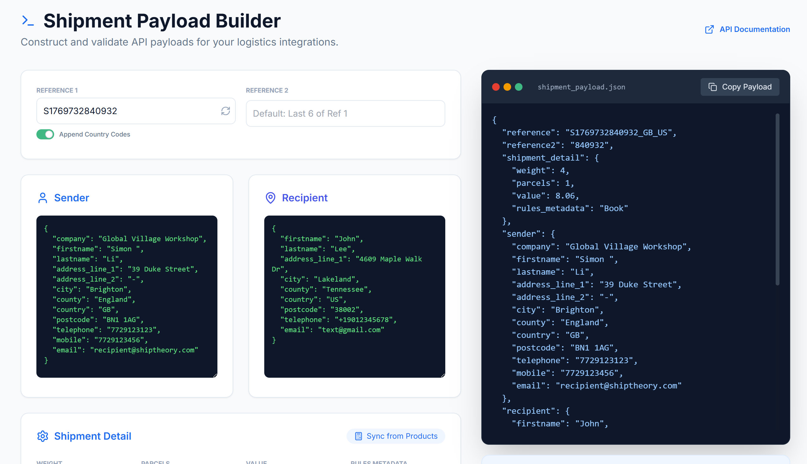

# Shipment Payload Builder

A browser-based tool to construct  **Shiptheory Shipment API** payload.

It is currently published at https://aisimon.github.io/shipment-tool/

## ✨ Features
- **Dynamic Payloads**: Live JSON preview as you edit
- **One-Click Copy**: Fast clipboard export for API testing.
- **Address Templates**: Preset sender/recipient JSON blocks.
- **Product Management**: Add multiple items with per-product **Dangerous Goods** (DG) support.
- **Smart Sync**: Calculate total weight and value from the product list automatically.

## Quick Start
1. Clone the repo: `git clone https://github.com/aisimon/shipment-tool.git`
2. Open `index.html` in your browser, or run `python3 -m http.server 8123` to serve it

## Tech
HTML5, Vanilla JS, [Tailwind CSS](https://tailwindcss.com/), [Lucide Icons](https://lucide.dev/).
